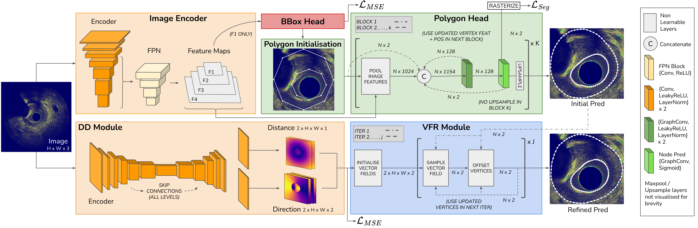

# POLYCORE: Polygon-based contour refinement for improved IntravascularUltrasound Segmentation
From  [Kit Mills Bransby](https://kitbransby.github.io/) (QMUL), [Retesh Bajaj](https://scholar.google.com/citations?user=7laMbzYAAAAJ&hl=en) (QMUL/Barts NHS), [Anantharaman Ramasamy](https://www.pcronline.com/Physicians/Anantharaman-Ramasamy) (QMUL/Barts NHS), Murat Cap (QMUL/Barts NHS), Nathan Yap (QMUL/Barts NHS), [Greg Slabaugh](https://www.eecs.qmul.ac.uk/~gslabaugh/) (QMUL), [Christos Bourantas](https://scholar.google.co.uk/citations?user=rQn8RpgAAAAJ&hl=en) (QMUL/Barts NHS), and [Qianni Zhang](https://scholar.google.co.uk/citations?user=XR6C9BoAAAAJ&hl=en) (QMUL)

This is the official implementation for the paper POLYCORE: Polygon-based contour refinement for improved Intravascular Ultrasound Segmentation published in Computers in Biology and Medicine (Sept, 2024).

Paper PDF: [Available Here](https://www.sciencedirect.com/science/article/pii/S0010482524012472)



## Introduction
Segmentation of the coronary vessel wall in intravascular ultrasound is a fundamental step in guiding coronary intervention. However, it is an challenging task, even for highly skilled cardiologists, due to image artifacts and shadowed regions caused by calcified plaque, guide wires and vessel side branches. Recently, dense-based neural networks have been applied to this task, however, they often fail to predict anatomically plausible contours in these low-signal areas. We propose a novel methodology called Polygon-based Contour Refiner (POLYCORE) that addresses topological error in dense-based segmentation networks using a relational inductive bias through higher-order connections between vertices to learn anatomically rational contours. Our approach remedies the over-smoothing phenomena common in polygon networks by introducing a new vector field refinement module which enables pixel-level detail to be added in an iterative process. POLYCORE is enhanced with augmented polygon aggregation which we show is more effective than typical dense-based test-time augmentation strategies. We achieve state-of-the-art results on two diverse datasets, observing particular improvements when segmenting the lumen structure and in topologically-challenging regions containing shadow artefacts. 

## Installation

```bash
# Clone the repository
git clone https://github.com/kitbransby/POLYCORE.git

# Navigate to the project directory
cd POLYCORE

# Create a virtual environment (optional but recommended)
conda env create -n polycore --file=requirements.yml

# activate env
conda activate polycore
```

To build the differentiable rasterization (native-rasterizer) module, [BoundaryFormer](https://github.com/mlpc-ucsd/BoundaryFormer) also needs to be installed. Perhaps there is a more efficient method to install native-rasterizer, but for simplicity we install BoundaryFormer/Detectron2 in full. This can be done as follows:

```bash
cd models
git clone https://github.com/mlpc-ucsd/BoundaryFormer.git
cd BoundaryFormer
pip install -ve .
```

You can test the rasterizer by running [these tests](https://github.com/mlpc-ucsd/BoundaryFormer/blob/boundary_former/projects/BoundaryFormer/run-rasterizer-tests.py).

## Dataset
Due to licensing restrictions, the NIRS-IVUS dataset is not publicly available. The IVUS-2011 dataset can be obtained upon request from the challenge organiser Simone Balocco. 

We assume all data stored in a separate data directory ``<DIR>/<Dataset Name>`` with the following structure:
```
<DIR>
├── <Dataset Name>
│   ├── Train
│   │   ├── Image
│   │   │   ├── 00001.npy
│   │   │   └── ...
│   │   └── Mask
│   │       ├── 00001.npy
│   │       └── ...
│   ├── Val 
│   │   └── ...
│   └── Test
│       └── ...
└── <Dataset Name>
    ├── Train
    ├── Val
    └── Test
```

## Training
We train POLYCORE in two stages. 
1. Coarse Polygon Initialisation (POLYCO)

```bash
cd Train/
python trainer.py --CFG POLYCO --BATCH_SIZE <chosen_bs> --VAL_BATCH_SIZE <chosen_bs> --DIR <directory_for_data_and_results>
```

Each training run is assigned a unique `NAME` id automatically, and the weights + loss curves are saved to ``$DIR/$NAME``

2. Vector Field Refinement (POLYCORE)

```bash
# Update 'WEIGHTS' field in POLYCORE.yaml with the $NAME of POLYCO run. 
# This loads the POLYCO weights, so we can just train the vector field refinement
cd Train/
python trainer.py --CFG POLYCORE --BATCH_SIZE <chosen_bs> --VAL_BATCH_SIZE <chosen_bs> --DIR <directory_for_data_and_results>
```

## Adapting the code for your dataset
To train on your own datasets, you will need to change some code. Here are some starters:
* Create a new pytorch dataset and dataloader in ``utils/<nameofdataset>Dataset.py`` and register it in ``Train/trainer.py``
* Check that the ellipse graph structure generated by ``utils/graph_utils/IVUS_Graph`` is appropriate for your task, or if some changes are required.

## Citing POLYCORE
If you use POLYCORE in your research, please use the following BibTeX entry: 

TBC


